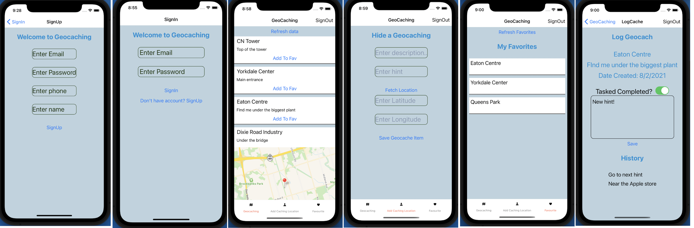

# Geocaching Application  
A cross platform React Native that enables users to search for geocaching sites and keep a record of the items they find. 

### 🖼️ Screenshots

## :books: Project Description
 
Geocaching is an outdoor activity where players hide random objects in random locations around a specific geographical area. The goal of the activity is to:
 1) hide objects for others to find
 2) locate objects hidden by others

If the player hides an object for others to find, the player must report the latitude and longitude of where they hid the object.

The object could be hidden include: under a rock in the forest, inside a tree stump, under a park bench, in a hole of a building’s brick wall.

## :woman_office_worker: :man_office_worker: Authors

[Mayank](https://github.com/mayankaryaca)
student ID: 101300566

[Wanja Mascarenhas](https://github.com/mascarenhaswanja)
student ID: 101280022

    
## :gear: Funcionalities
Display a list of geocaching sites that are near the current location of the user’s
device
- Display the nearby geocaching sites on a map (with pins)
- Show details about a specific geocaching site (the name of the cache, description of the
item the person is searching for, latitude and longitude)
- Ability to mark a specific geocaching site as a “favorite”
- Record keeping features:
  - User can track which geocache sites they have “in progress” or “completed”
  - User can keep notes about a specific geocache site  
  - User can take a photo of the geocache site  

## :white_check_mark: Attribution
 Intro to Geocaching: https://www.youtube.com/watch?v=xE-zMPhiAi0